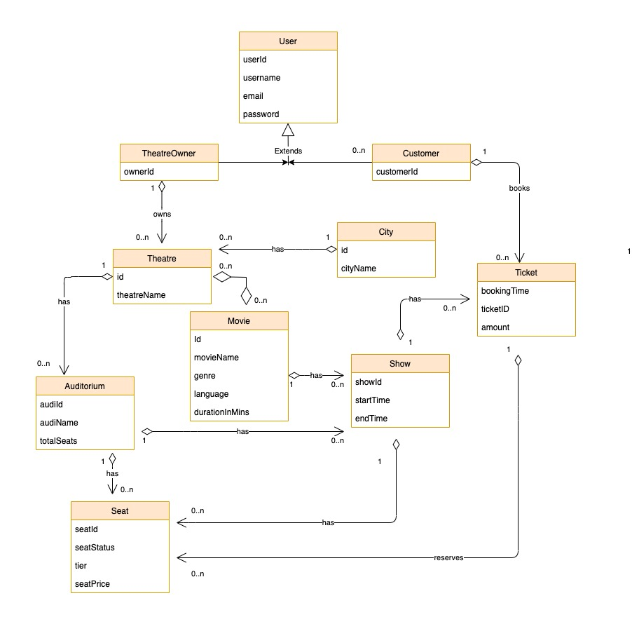

# BookMyShow

This project contains the low level design implementation for an online ticketing system that sells movie tickets like BookMyShow.
    
A demo for the APIs interaction [BookMyShow Demo](http://bit.ly/bookmyshow-demo)

## Model class relationships

The class diagram includes:
  - Representation of **normalized** tables to ensure **ACID** properties in our relational database.
  - concepts of OOPs like **inheritance, composition and abstraction** of real world entities to derive their relationships e.g, Auditorium has 0 to n seats, Customer books 0 to n tickets, etc



## Important APIs

  - Registration of Customer and Theatre Owners
    ```java
    POST /owner/create
    POST /customer/create
    ```
  - Display cities
    ```java
    POST /city/create
    GET /city/display
    ```
  - Add and Display movie in a city
    ```java
    POST /theatre/{theatreId}/movie/create"
    GET /city/{cityId}/movie/display
    ```
  - Add and display movie show 
    ```java
    POST /create/show/movie/{movieId}/audi/{audiId}
    GET /show/display/theatre/{theatreId}
    ```
  - Add, display and book seats
    ```java
    POST /seat/show/{showId}/create
    GET /display/seat
    POST /book/seat
    ```

## DB Tables Screenshot

Following image shows the migrated tables in postgres database with few mock data.


## Extensions

This project only focuses on minimum viable functionalities given time constraints, there are few extensions that we can implement:
- Integrate payments service with different tiers of seats.
- Aquire locks while booking seats in a concurrent execution.
- Use async workers and a queue (rabbitmq/redis/kafka), to process and send ticket documents to user after booking.
- Authentication and Authorization.
- Add loggers to support debugging and application metrics.
